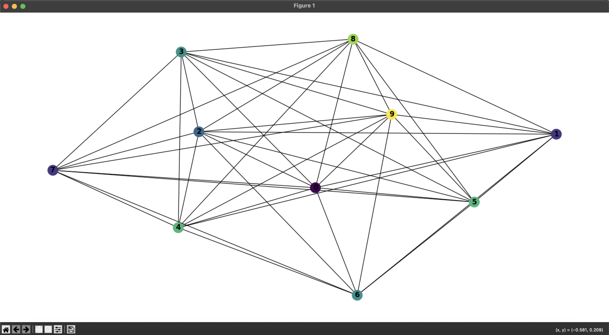

# 🎨 Graph Coloring Algorithm - University Project

Welcome to my university project! 📚  
This project implements a **Greedy Graph Coloring Algorithm** using Python and NetworkX.

---

## 🚀 Features

- 📌 Builds a random undirected graph with 40 nodes
- 🎨 Colors the graph using a **greedy algorithm**
- ✅ Verifies the coloring validity (no two adjacent nodes share the same color)
- 📊 Visualizes the result with `matplotlib`

---

## 📚 About the Project

This project was developed as part of a university course in Computer Science.  
The goal was to demonstrate an understanding of **graph theory**, algorithm design, and Python-based data visualization.  
It showcases how to approach the **graph coloring problem** using a simple and efficient greedy technique.

---

## 🧠 How It Works

1. Generate a graph of `n = 40` nodes.
2. Randomly add edges with a 10% probability between node pairs.
3. Apply the **greedy coloring algorithm**:
   - For each node, assign the smallest possible color not used by its neighbors.
4. Validate the result using a helper function.
5. Plot the graph with each node colored according to its assigned color.

---

## 🖥️ Technologies & Dependencies

- Python 🐍
- [NetworkX](https://networkx.org/) - Graph creation & operations
- [Matplotlib](https://matplotlib.org/) - Graph visualization
- `random`, `itertools` - Core logic helpers

Install dependencies via [Poetry](https://python-poetry.org/):

```
bash
poetry install
````

Or manually using pip:

```bash
pip install networkx matplotlib
```

---

## 🔍 Sample Output

```bash
Coloring: {0: 0, 1: 1, 2: 0, ...}
Valid: True
K: 7
```

* 🟢 `Valid: True` means adjacent nodes have different colors.
* 🎯 `K` shows the number of colors used in total.

---

## 📸 Screenshot



---

## 🛠️ Future Improvements

* 🧪 Add unit tests for corner cases
* 📈 Benchmark performance on larger graphs
* 🧠 Compare with other algorithms (e.g. DSATUR, Backtracking)
* 🌐 Build a small web app with visualization using `D3.js` or `Plotly`

---

## 👨‍🎓 Author

Made with ❤️ by **Hesam**
This project is part of a university assignment for the Computer Science program.
Feel free to use, explore, or build upon it for educational purposes! 🧑‍💻


